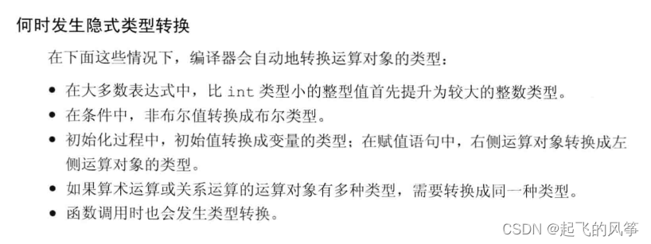

# C++中的类型转换
## C语言中的类型转换
### 隐式类型转换
- `C`语言中类型转换发生的时机: 赋值运算符左右两边类型不相等 , 形式参数和实际参数类型不匹配 , 或者返回值类型和接受值类型不相同的时候就会发生类型转换
- 类型转换的种类:
  - 隐式类型转化：编译器在编译阶段自动进行，能转就转，不能转就编译失败
  - 显式类型转化：需要用户自己处理
- 隐式类型转换:
```c
int a = 10;
double b = a;  

double c = 3.14;
int d = c; // 注意精度不同可能会遗失一部分精度

double e = 3.14;
int f = 3;
int d = f + e ;  // 首先统一 f 和 e 的类型之后进行隐式类型转换
```
- 注意隐式类型转换的缺点:  
  - 根据上述描述，大家需要注意的是，过度使用类型转换可能会导致代码难以理解和维护；
  - 例如，如果你在代码中看到大量的类型转换，那么这可能意味着你的代码应该被重构以减少这种不透明性；
  -  此外，使用类型转换可能会违反一些编程原则，如“不要直接操作值”，因为这可能会导致代码的可读性和可维护性下降。
### 显示类型转换
- 显式类型转换:
  - 使用特殊函数`atoi`等
  - 使用类型强制转换
- 显式类型转换演示:
```c
#include<stdio.h>
int main()
{
    // 显示类型转换
    int a = 1;
    double b = 3.14;
    int c = (int)(a + b);
    printf("c = %d \n" , c);  // 4
    // 将指针类型转换为数字类型
    int* p = &a;
    int d = (int)p;
    printf("d = %d , p = %x \n" , d  , p); // 注意此时把 p 指向的数第的之赋值给了 d
    void* pv = 120;
    int f = (int)pv;
    int* pi = 120;
    int k = (int)pi;
    printf("f = %d , k = %d \n" , f , k); // 120,指向常数可以直接转换
    char* str = "1234";
    // 使用内置函数
    int i = atoi(str);
    printf("i = %d \n" , i);

}
```
- 显示类型转换的缺点:
  - 总体而言，C语言的类型转换是一项强大但需要小心使用的功能；
  - 程序员应该确保了解数据转换的可能影响，并在需要时采取适当的预防措施；
  - 其次，面临着转换的可视性比较差，所有的转换形式都是以一种相同形式书写，难以跟踪错误的转换等等缺陷
## C++中的类型转换方式
### 隐式类型转换
- 发生时机:

- 算术类型的转换:
```cpp
bool a = 10; //a为真
int i = a;	//i的值为1
 
i = 3.1415; //i的值为3
 
double pi = i;	//pi的值为3.0
 
unsigned char b = -1; //假设char占8比特，则b为255 (注意)
 
signed char c = 256;  //假设char占8比特，c的值是未定义的
```
- 含有无符号的表达时的转换:
```cpp
unsinged int a = 10;
int i = -21;
cout << i + i << endl;
cout << a + i << endl; // 此时就会发生类型转换
```
- 数组转换成指针,数组的首地址一般会自动转换成指针:
  - 当数组被用作decltype关键字的参数，或者作为取地址符(&)、 sizeof 及typeid等运算符的运算对象时，上述转换不会发生；
  - 同样的，如果用一个引用来初始化数组，上述转换也不会发生；
  - 当在表达式中使用函数类型时会发生类似的指针转换。
#### 指针的转换:
- 涉及到空指针的转换:
```cpp
int* array = 0; // 相当于 array = NULL;
```
- 使用`nullptr`(可以转换成任意类型的指针,不会被当成`0`)
```cpp
//nullptr 是C++11引入的空指针字面值，它可以被隐式转换为任意指针类型
//相较于使用整数值 0，使用 nullptr 更为类型安全，因为它是一个特殊的空指针值，而不是整数。
int* arry= nullptr;
```
- 另外几条规则:
  - 指向非常量的指针可以被转换为 `void*` 类型
  - 指向任意类型的指针都可以转换为 `const void*` , 但是可能会遗失一部分信息
```cpp
#include<iostream>
using namespace std;
int main()
{
    char* str = "hello";
    const void* ptr = str;
    cout << (*(char*)ptr) << endl;
}
```
#### 转换成 bool 类型
- 整数转换为 `bool` 类型,如果不是 `0` 就可以转换为 `true` , 如果是 `0` 就可以转换为 `false`
- 指针类型转换为 `bool` 类型,如果是 `nullptr`或者`NULL`为 `false` 否则为 `true`
#### 转换成常量
- 允许将指向非常量类型的指针转换成指向相应的常量类型的指针，对于引用也是这样；
- 也就是说，如果T是一种类型，我们就能将指向T的指针或引用分别转换成指向const T的指针或引用
- 但是把常量转换为非常量不可以
```cpp
int i;
const int& j = i; //非常量转换成const int的引用
const int* p = &i;//非常量的地址转换成 const的地址
```
### 显式类型转换
- `C++`中的四种强制类型转换的操作符号:
  - `static_cast`
  - `reinterpret_cast`
  - `const_cast`
  - `dynamic_cast`
#### static_cast
- `static_cast` ：任何具有明确定义的类型转换,只要不包含底层`const`,都可以使用`static_ cast`。编译器隐式执行的任何类型转换都可用`static_cast`   
下面介绍使用情景
1. 进行基本数据类型之间的转换:
```cpp
double b = 3.14;
int a = static_cast<int>(b);
cout << "a = " << a << endl;
```
2. 指针类型之间的转换:
```cpp
int c = 20;
void* d = static_cast<void*>(&c);
```
3. 父子类指针或引用转换：`static_cast` 可以进行父子类之间的指针或引用转换，前提是这两个类之间必须存在继承关系
```cpp
#include<iostream>
using namespace std;
class Base{
public:
    virtual void foo()
    {
        cout << "this is father " << endl;
    }
};

class Son: public Base{
public:
    virtual void foo()
    {
        cout << "this is son " << endl;
    }
};
int main()
{
    Base* pb1 = new Son();
    Son* pb = static_cast<Son*>(pb1);
    pb -> foo();  // 底层的指针还是指向了子函数
}
```
- 使用 `static_cast`的注意事项:
    - 当我们把指针存放在void*中，并且使用static_ cast 将其强制转换回原来的类型时，应该确保指针的值保持不变；
    - 也就是说，强制转换的结果将与原始的地址值相等，因此我们必须确保转换后所得的类型就是指针所指的类型；
    - 类型一旦不符，将产生未定义的后果。
#### reinterpret_cast
- `reinterpret_cast`：操作符通常为操作数的位模式提供较低层次的重新解释，**用于将一种类型转换为另一种不同的类型**
- 比如:
```cpp
int *num;
char *pc = reinterpret_ cast<char*>(num) ;
```
- 但是这是非常危险的,只是由于此时 地址没有改变 `pc` 还是指向了 `num`所以后续操作可能出错
#### const_cast
- `const_cast`：是用于在编译时去除对象的 `const` 或 `volatile` 修饰
- 使用情况如下:
```cpp
const int num = 10;
    int* pn = const_cast<int*>(&num);
    *pn = 101;
    cout << num << endl;
    cout << *pn << endl;
```
- 实现方式:
  - 这里是因为 const的原因，加了const之后编译器默认会进行优化操作；
  - 因为编译器默认认为const是不能直接被修改的，如果想去直接修改是无法完成的，这里只能是间接的发生了修改操作；
  - 有些地方会把这里的 num 存到寄存器，此时不会去内存中取 num，而是去寄存器当中取数据；而有些编译器则把这里当作"宏” 的效果一样，编译的时候直接替换即可。
#### dynamic_cast
- `dynamic_cast`：用于将一个父类对象的指针/引用转换为子类对象的指针或引用(动态转换)。它主要用于类层次结构中的向上转换和向下转换，并且只能用于包含虚函数的类。
- 子类转为父类一不能不需要进行转换
- 但是父类转换为子类需要转换,这就需要使用 `dynamic_cast`进行转换
- 而`dynamic_cast`在这个地方的好处就是:它是先检查你这个父类的指针，如果你指向父类，此时就转换失败，如果你指向子类呢，我才会转换成功：
```cpp
#include<iostream>
using namespace std;
class Base{
public:
    virtual void foo()
    {
        cout << "this is father " << endl;
    }
};

class Son: public Base{
public:
    virtual void foo()
    {
        cout << "this is son " << endl;
    }
};
int main()
{
    double b = 3.14;
    int a = static_cast<int>(b);
    cout << "a = " << a << endl;

    int c = 20;
    void* d = static_cast<void*>(&c);

    // Base* pb1 = new Son();
    // Son* pb = static_cast<Son*>(pb1);
    // pb -> foo();  // 底层的指针还是指向了子函数

    const int num = 10;
    int* pn = const_cast<int*>(&num);
    *pn = 101;
    cout << num << endl;
    cout << *pn << endl;

    Base* pb = new Son();
    Son* pa;
    pa = dynamic_cast<Son*>(pb);

    Base* pb1;
    Son* pa1;
    pb1 = pa1;  // 直接转换成功
    // Base* pb ;
    // Son* pa;
    // pa = dynamic_cast<Son*>(pb);  error 检查 是否指向子类,种现象子类才可以转换成功
}
```
- 但是对于 `static_cast`如下情况也可以转换成功:
```cpp
Base* pb ;
Son* pa;
pa = static_cast<Son*>(pb);
```
- 注意指针本质也是一个整形变量,本质就是记录了地址,之后编译器就可以通过指针记录的地址找到需要的变量了
- 总结:
  - 隐式类型转换：当编译器自动将一种类型转换为另一种类型时，称为隐式类型转换。例如，将一个整数赋值给一个浮点数变量时，编译器会自动将整数转换为浮点数。

  - 显式类型转换：当程序员明确指定将一种类型转换为另一种类型时，称为显式类型转换。在C++中，有四种显式类型转换运算符：`static_cast`、`dynamic_cast`、`const_cast`和`reinterpret_cast`。

  - `static_cast`：用于基本的类型转换，如将整数转换为浮点数，指针转换为整数等。它可以在编译期进行类型检查，但不能用于没有继承关系的类之间的转换。

  - `dynamic_cast`：用于在继承关系中的类型转换。它会在运行时进行类型检查，如果转换不安全，则返回nullptr或抛出异常。

  - `const_cast`：用于去除变量的const或volatile属性。它可以用于修改常量对象的值，但需要谨慎使用，因为违反了const的语义。

  - `reinterpret_cast`：用于将一个指针或引用转换为另一个不相关的类型。它没有类型检查，因此非常危险，可能导致
# 尽可能使用 const
## 利用const修饰指针
1. 如果`const`出现在`*`的左边表示指针指向的变量不可以修改,以下两种情况等效(但是指针的指向可以改变):
```c
const char* p = "hello";
char const* p = "world";
```
2. 如果`const`出现在`*`的右边,表示指针的指向不可以改变(但是指针指向的值可以改变):
```c
char* const p = "hello";
```
## 利用 `const` 修饰 `STL` 容器的迭代器
- `const vector<int>::iterator`  等价于 `const` 出现在 `*` 的右边表示指针的指向不可以修改,但是指针指向的值可以修改
- `vector<int>::const_iterator` 等价于 `const` 出现在 `*` 的左侧,表示指针指向的值是常量,不可以修改
```cpp
#include<iostream>
#include<vector>
using namespace std;
int main()
{
    vector<int> v;
    for(int i = 0 ; i < 5 ; i ++){
        v.push_back(i);
    }
    // const vector<int>::iterator
    // 错误的,此时注意 it的指向不可以发生改变
    // for(const vector<int>::iterator it = v.begin() ; it != v.end() ; it++){

    // }
    // vector<int>::const_iterator 表示指针执行的值得不可以改变
    for(vector<int>::const_iterator it = v.begin() ; it != v.end() ; it ++){
        cout << *it << "  ";
    }
    cout << endl;
}
```
## 利用 const 修饰函数的返回值
- 注意如果不想要让函数的返回值可以作为可以赋值的左值(针对于指针或者引用),就需要加上 `const` 修饰函数的返回值
```c
const Rational operator *(const Rational& lhs , const Rational& rhs);
```
- 注意参数的表示方式:  `lhs` 表示左手边的参数 `rhs` 表示右手边的参数
## const成员函数(常函数)
- `const`成员函数的优点:
  - 可以使得`class`接口比较容易理解,那些函数可以修改成员的值,那些函数不可以一目了然
  - 使得操作`const`对象成为可能,这是由于常对象只可以调用常函数
- 注意引用传递和值传递的区别,就是是否可以作为右值
- 注意是否由 `const` 修饰这一点可以作为函数重载的依据:
```cpp
#include<iostream>
#include<string>
using namespace std;
class Base{
public:
    Base(string str): text(str) {}
    const char& operator[] (int index) const
    {
        cout << "return a const reference to char " << endl;
        return text[index];
    }

    char& operator[] (int index)
    {
        cout << "return a reference to char" << endl;
        return text[index];
    }

private:
    string text;
};
int main()
{
    Base b1("hello");
    const Base b2("hello");
    cout << b1[2] << endl;
    cout << b2[2] << endl;
}
```
## 两种不同的思想
- `bitwise constness`: 表示如果函数被`const`修饰,那么这一个函数就不可以用于修改类中的某一个成员,但是这一种思想是错误的,这是由于如果被`const`修饰的函数传递出来一个非`const`修饰的引用,那么就会给外界提供一个修改变量的值的接口,所以这一种思想是不合理的
- `logical constness`: 一个`const`成员函数可以修改它所处理的对象,但是必须是在客户端察觉不到的情况下才可,但是这一种思想的实现依赖于`mutable`关键字,这一个关键字表示这一个变量可以在被 `const` 修饰的常函数中使用
## const 和 non-const成员函数中避免重复
- 主要讨论关于利用`const`修饰的成员函数的重载问题,如果利用`const`修饰的成员函数和它的重载函数之间由许多重复的代码,如何避免这些重复的代码? 
  - 第一种思路就是在 `const` 中调用 `non-const`但是很明显这一种思路中给`const`函数提供了修改成员的接口
  - 第二种思路就是在 `non-const`中调用 `const`,这一种思路需要使用类型转换
  - 实现思路:
```cpp
#include<iostream>
#include<string>
using namespace std;
class Base{
public:
    Base(string str): text(str) {}
    const char& operator[] (int index) const 
    {
        cout << "模拟业务逻辑代码 ..." << endl;
        return text[index];
    }
    char& operator[] (int index)
    {
        return const_cast<char&>(
            (static_cast<const Base&>(*this))[index] // 只是改变类型没有改变指针指向
        );
    }

private:
     string text;
};
int main()
{
    Base b("hello");
    cout << b[1] << endl;
}
```
- 请记住:
  - 将某些东西声明为`const`(比如引用),可以帮助编译器侦测错误用法,`const`可以被时加于任何作用域内的对象,函数对象,函数参数和函数返回值,成员函数本体
  - 编译器强制实施`bitwise constness`,但是你必须使用"概念上的常量性"
  - 当`const`和`non-const`等价的时候,注意需要让 `non-const` 调用 `const` 减少代码的重复