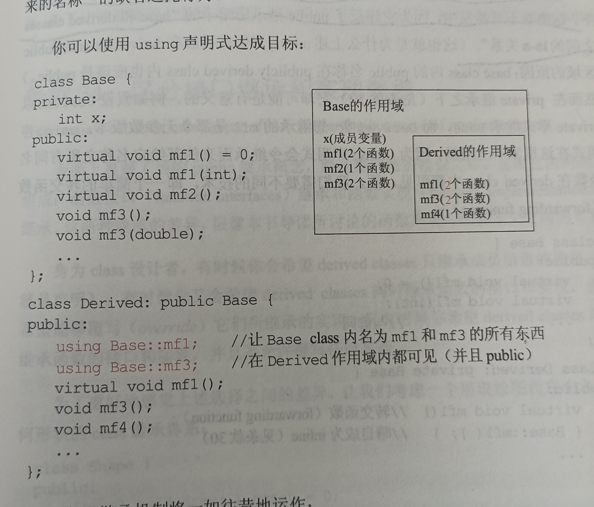

# 避免遮掩继承而来的名称
- 本条款主要用于讨论在`is - a`模型下,主要讨论子类和父类中的各种函数名称的作用域问题
- 作用域: 比如全局作用域和局部作用域
1. 注意子类的作用域被嵌套在父类的作用域中,比如这样,并且这一种嵌套和类型无关,只是讨论名称的作用域：

- 所以如果在子类中调用这样的函数:
```cpp
void Derived::mf4()
{
    mf2();
}
```
- 查找方式: 首先查找`local`作用域(也就是`mf4`函数覆盖的作用域),之后查找外围作用域(也就是`class Derived`覆盖的作用域),在往外围寻找,也就是`Base class`覆盖的作用域,在就是`Base class`所在的命名空间,最后就在`global`作用域中寻找
2. 子类中的作用域如果出现父类作用域中同名的变量会覆盖父类中同名的变量,考入如下继承结构:

- 考虑如下测试用例:
```cpp
d.mf1();  // 没有问题,在子类的作用域中
d.mf1(x); // err ,此时子类作用域中的mf1遮掩了父类作用域中的 mf1
d.mf2();
d.mf3();
d.mf3(x); // 子类的 mf3遮掩了父类中的mf3(int)
```
3. 考虑如何让子类中的同名变量或者函数不会遮掩父类中的同名变量或者函数,可以使用`using`关键字,比如:

- 还是考虑如下测试用例(全部可行):
```cpp
d.mf1();  
d.mf1(x); 
d.mf2();
d.mf3();
d.mf3(x);
```
4. 另外一种让遮掩的名称重见天日的方式就是利用转交函数,比如:
```cpp
class Base {
public:
    virtual void mf1() = 0;
    virtual void mf1(int);
    ...
};

class Derived: private Base {
public:
    virtual void mf1()  // 这就是一个转交函数
    {
        Base::mf1();
    }
};

Derived d;
int x;
d.mf1();
d.mf1(x); //err,此时 Base::mf1() 被遮掩了(但是还是可以为它定义相关的转交函数)
```
- 总结:
  - 子类中的名称会遮掩父类中的名称,在`public`继承下从来没有人希望如此(也就是子类可以使用父类中的任何本领)
  - 为了让遮掩的名称重见天日,可以使用`using`声明式或者转交函数