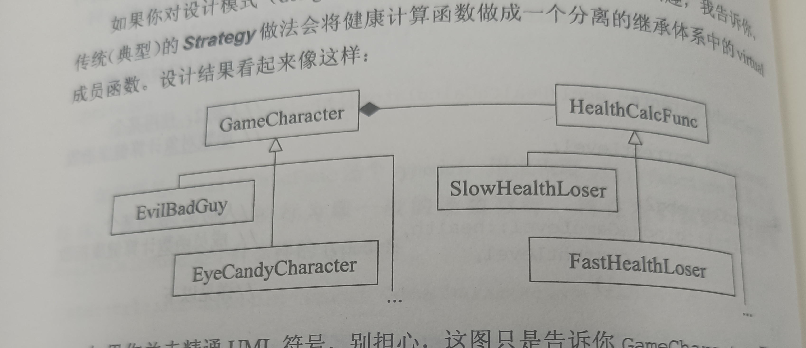

# 考虑virtual函数之外的选择
- `virtual`关键字的作用可以让子类重写父类中的函数或者继承函数的声明,但是拓展性比较差,本条款主要考虑集中可以替代`virtual`的行为
- 假设下面所有的情况都是针对于一个父类,比如如下父类(自己写的一种父类):
```cpp
class Person{
public:
    virtual void get_up();
};
```
- 这里定义了人的起床方式,不同的子类的这一个方法的实现情况不同,如果利用`virutal`,子类需要重写父类中的这一个方法
## 利用Non-Virtual-Interface 实现 Template-Method模式
- 也就是利用非虚函数接口的形式实现模板方法(不同的子类继承同一个非虚函数,但是这一个非虚函数总调用这一个虚函数),具体的实现方法如下:
```cpp
#include<iostream>
#include<string>
using namespace std;
class Person {
public:
    void get_up()
    {
        cout << "睡觉中 ..." << endl;  // 准备工作
        way_to_get_up();
        cout << "刷牙 ..." << endl;  // 结束工作
    }
private:
    virtual void way_to_get_up()
    {
        cout << "起床了" << endl;
    }
};

class Student: public Person {
private:
    virtual void way_to_get_up() override 
    {
        cout << "学生起床了" << endl;
    }
};

class Worker: public Person {
private:
    virtual void way_to_get_up() override 
    {
        cout << "工人起床了" << endl;
    }
};

void func(Person* p)
{
    p -> get_up();
}

int main()
{
    Person* p = new Student();
    Person* p1 = new Worker();
    func(p);
    func(p1);
}
```
- 这一种方式的好处就是可以对于代码的功能进行拓展,比如在需要重写的代码之前做准备工作,调用结束之后做结束工作,缺点就是那一确定`virtual`函数的访问权限
## 使用函数指针实现
- 这一种方式将带来更大的灵活性,甚至可以让不同的对象的处理问题的方式不同
- 实现方式:
```cpp
#include<iostream>
#include<string>
using namespace std;
class Person;
void default_handler(Person& p)
{
    cout << "起床了" << endl;
}
class Person{
public:
    using get_up_handler = void(*)(Person&);  // 定义函数指针类型
    Person(get_up_handler handler = default_handler): handler(handler) {}
    void get_up()
    {
        // 前置增强
        handler(*this);
        // 后置增强
    }

private:
    get_up_handler handler;
};

class Student: public Person {
public:
    Student(get_up_handler handler = default_handler): Person(handler) {}
};


class Worker: public Person {
public:
    Worker(get_up_handler handler = default_handler): Person(handler) {}
};

void student1_get_up(Person& p)
{
    cout << "第一个学生起床了" << endl;
}

void student2_get_up(Person& p)
{
    cout << "第二个学生起床了" << endl;
}

void worker_get_up(Person& p)
{
    cout << "工人起床了" << endl;
}
void func(Person* p)
{
    p -> get_up();
}

int main()
{   
    Person* sp1 = new Student(student1_get_up);
    Person* sp2 = new Student(student2_get_up);
    Person* wp = new Worker(worker_get_up);
    func(sp1);
    func(sp2);
    func(wp);
}   
```
- 缺点: 只是可以处理函数指针不可以处理其他的可调用对象类型
## 使用function实现
- 和上面相比可以调用多种对象,包含仿函数或者函数指针对象
```cpp
#include<iostream>
#include<string>
#include<functional>
using namespace std;
class Person;
void default_handler(Person& p)
{
    cout << "起床了" << endl;
}
class Person {
public:
    using get_up_handler = function<void(Person&)>;
    Person(get_up_handler handler = default_handler): handler(handler) {};
    void get_up()
    {
        // ...
        handler(*this);
        // ...
    }
private:
    get_up_handler handler;
};


class Student: public Person {
public:
    Student(get_up_handler handler = default_handler): Person(handler) {}
};

class Worker: public Person {
public:
    Worker(get_up_handler handler = default_handler): Person(handler) {}
};

class Student2_hanlder{
public:
    void operator()(Person& p)
    {
        cout << "学生2起床了" << endl;
    }
};
void func(Person* p)
{
    p -> get_up();
}

void work_handler(Person& p)
{
    cout << "工人起床了" << endl;
}
int main()
{
    Person* p1 = new Student([=](Person& p){
        cout << "学生1起床了" << endl;
    });

    Person* p2 = new  Student(Student2_hanlder());

    Person* p3 = new Worker(work_handler);

    func(p1);
    func(p2);
    func(p3);

}
```
## 古典的策略设计模式
- 也就是不光把对象设计成继承体系,同时还把对象需要调用的方法设计成继承体系(当然需要使用一个类来封装对象中方法)
- 继承结构如下:


- 总结:
  - `virtual`函数的替代方案包含: 利用`NVI`和策略设计模式的多种形式,`NVI`手法本质上就是一个模板方法模式
  - 将机能从成员函数转移到`class`外部函数,缺点就是非成员函数无法访问`class`内的非公共属性(可以使用友元)
  - `function`对象的行为就像一般的函数指针,的那是这样的对象可以接纳"于给之目标签名式"兼容的所有可调用物